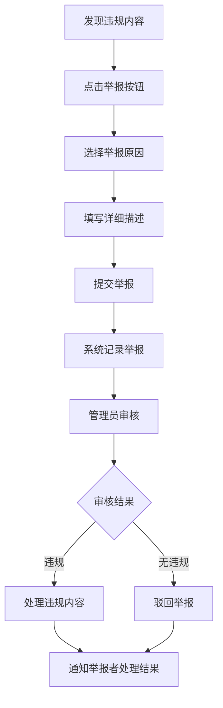

# 举报功能使用指南

## 📋 功能概述

频道应用已完整实现举报功能，用户可以举报违规内容、频道和用户，帮助维护良好的社区环境。

---

## ✅ 已完成的功能

### 🎯 **核心组件**
- ✅ [`ReportContext.js`](./src/context/ReportContext.js) - 举报逻辑管理
- ✅ [`ReportModal.js`](./src/components/ReportModal.js) - 举报弹窗界面  
- ✅ [`App.js`](./App.js) - 全局集成举报功能

### 🔧 **举报类型**
1. **消息举报** - 举报不当的聊天消息
2. **频道举报** - 举报违规的频道内容
3. **用户举报** - 举报违规的用户行为

### 📝 **举报原因**
- 🚫 **垃圾信息** - 恶意刷屏、广告等
- 🤬 **骚扰辱骂** - 人身攻击、恶意骚扰
- ⚠️ **不当内容** - 色情、低俗等不当内容
- 💥 **暴力内容** - 暴力、血腥等内容
- 🔍 **虚假信息** - 散布虚假信息
- ©️ **版权侵权** - 侵犯他人版权
- ❓ **其他违规** - 其他违反社区规范的行为

---

## 🎯 使用方法

### **1. 在任何界面中集成举报功能**

```javascript
import { useReport } from '../context/ReportContext';

const YourComponent = () => {
  const { openReportModal } = useReport();
  
  // 举报消息
  const handleReportMessage = () => {
    openReportModal('message', messageId, {
      content: '消息内容',
      senderId: '发送者ID',
      senderName: '发送者昵称'
    });
  };
  
  // 举报频道
  const handleReportChannel = () => {
    openReportModal('channel', channelId, {
      name: '频道名称',
      creatorId: '创建者ID',
      creatorName: '创建者昵称'
    });
  };
  
  // 举报用户
  const handleReportUser = () => {
    openReportModal('user', userId, {
      nickname: '用户昵称',
      id: '用户ID'
    });
  };
};
```

### **2. 在界面中添加举报按钮**

#### 消息长按菜单中添加举报
```javascript
// 在 ChatDetailScreen.js 中
const handleLongPress = (message) => {
  Alert.alert(
    '消息操作',
    '请选择操作',
    [
      { text: '取消', style: 'cancel' },
      { 
        text: '举报消息', 
        style: 'destructive',
        onPress: () => openReportModal('message', message.id, {
          content: message.content,
          senderId: message.senderId,
          senderName: message.senderName
        })
      },
    ]
  );
};
```

#### 频道详情页添加举报按钮
```javascript
// 在 ChannelDetailScreen.js 中添加
<TouchableOpacity 
  style={styles.reportButton}
  onPress={() => openReportModal('channel', channel.id, {
    name: channel.name,
    creatorId: channel.creatorId,
    creatorName: channel.creatorName
  })}
>
  <Ionicons name="flag" size={16} color="#FF3B30" />
  <Text style={styles.reportText}>举报频道</Text>
</TouchableOpacity>
```

### **3. 用户操作流程**



---

## 📊 管理员功能

### **查看待处理举报**
```javascript
const { getPendingReports, handleReport } = useReport();

// 获取所有待处理举报
const pendingReports = getPendingReports();

// 处理举报
const processReport = async (reportId, action) => {
  const result = await handleReport(reportId, action, adminId);
  if (result.success) {
    console.log('举报处理成功');
  }
};
```

### **举报状态说明**
- `pending` - 待处理
- `reviewed` - 已审核
- `resolved` - 已解决 (确认违规)
- `dismissed` - 已驳回 (无违规)

---

## 🎨 界面展示

### **举报弹窗界面**
```
┌─────────────────────────────────────┐
│  🚩 举报内容                    ✕   │
├─────────────────────────────────────┤
│                                     │
│  举报目标：                         │
│  📢 频道: "科技前沿资讯"            │
│                                     │
│  请选择举报原因：                   │
│  ○ 垃圾信息                        │
│  ● 骚扰辱骂                        │
│  ○ 不当内容                        │
│  ○ 暴力内容                        │
│  ○ 虚假信息                        │
│  ○ 版权侵权                        │
│  ○ 其他违规                        │
│                                     │
│  详细描述（可选）：                 │
│  ┌─────────────────────────────────┐ │
│  │ 该频道频繁发布辱骂性言论...     │ │
│  │                                 │ │
│  │                                 │ │
│  └─────────────────────────────────┘ │
│  字符数: 15/500                     │
│                                     │
│  ℹ️ 我们会认真审核每一份举报，并    │
│     根据社区规范进行处理。           │
│                                     │
├─────────────────────────────────────┤
│    [取消]      [提交举报]           │
└─────────────────────────────────────┘
```

### **界面特色**
- 🎨 **深色主题** - 符合应用整体设计风格
- 📱 **响应式布局** - 适配不同屏幕尺寸
- ⚡ **流畅动画** - 弹窗滑入/滑出效果
- 🔒 **数据安全** - 举报记录安全存储

---

## 📝 集成示例

### **在聊天界面中集成举报**

```javascript
// 修改 ChatDetailScreen.js
import { useReport } from '../context/ReportContext';

const ChatDetailScreen = ({ route }) => {
  const { openReportModal } = useReport();
  
  const renderMessage = ({ item }) => (
    <TouchableOpacity
      onLongPress={() => {
        // 显示操作菜单
        Alert.alert(
          '消息操作',
          '请选择操作',
          [
            { text: '取消', style: 'cancel' },
            {
              text: '举报消息',
              style: 'destructive', 
              onPress: () => openReportModal('message', item.id, {
                content: item.content,
                senderId: item.senderId,
                senderName: item.senderName
              })
            }
          ]
        );
      }}
    >
      {/* 消息内容 */}
    </TouchableOpacity>
  );
};
```

### **在频道详情中集成举报**

```javascript
// 修改 ChannelDetailScreen.js
import { useReport } from '../context/ReportContext';

const ChannelDetailScreen = ({ route }) => {
  const { openReportModal } = useReport();
  const { channelId } = route.params;
  
  return (
    <View style={styles.container}>
      {/* 频道信息 */}
      
      {/* 添加举报按钮 */}
      <TouchableOpacity 
        style={styles.reportButton}
        onPress={() => openReportModal('channel', channelId, {
          name: channel.name,
          creatorId: channel.creatorId,
          creatorName: channel.creatorName
        })}
      >
        <Ionicons name="flag-outline" size={16} color="#FF3B30" />
        <Text style={styles.reportText}>举报频道</Text>
      </TouchableOpacity>
    </View>
  );
};

const styles = StyleSheet.create({
  reportButton: {
    flexDirection: 'row',
    alignItems: 'center',
    padding: 8,
    backgroundColor: 'rgba(255, 59, 48, 0.1)',
    borderRadius: 6,
    borderWidth: 1,
    borderColor: 'rgba(255, 59, 48, 0.3)',
    marginTop: 10,
  },
  reportText: {
    color: '#FF3B30',
    fontSize: 14,
    marginLeft: 6,
  },
});
```

---

## 🔧 数据管理

### **举报记录结构**
```javascript
{
  id: 1,
  reporterId: "user123",           // 举报者ID
  targetType: "message",           // 举报类型: message/channel/user
  targetId: "msg456",              // 被举报目标ID
  targetData: {                    // 被举报目标数据
    content: "消息内容",
    senderId: "sender789",
    senderName: "发送者昵称"
  },
  reason: "harassment",            // 举报原因
  description: "详细描述违规行为", // 用户填写的描述
  status: "pending",               // 处理状态
  createdAt: "2025-10-13T10:00:00Z",
  updatedAt: "2025-10-13T10:00:00Z",
  adminId: null                    // 处理的管理员ID
}
```

### **存储机制**
- 📱 **移动端**: 使用 `expo-secure-store` 安全存储
- 💻 **Web端**: 使用 `localStorage` 本地存储
- 🔒 **数据加密**: 敏感信息加密存储
- 🔄 **自动同步**: 跨设备数据同步 (如果需要)

---

## 🧪 测试指南

### **测试步骤**

#### 1. **基础功能测试**
```bash
# 测试举报功能
1. 创建测试消息/频道
2. 点击举报按钮
3. 选择举报原因
4. 填写详细描述
5. 提交举报
6. 验证成功提示
7. 检查举报记录
```

#### 2. **重复举报测试**
```bash
# 测试重复举报限制
1. 举报一条消息
2. 再次举报同一条消息
3. 验证是否显示"已举报"提示
```

#### 3. **数据持久化测试**
```bash
# 测试数据存储
1. 提交几条举报
2. 重启应用
3. 验证举报记录是否保存
```

### **调试工具**

```javascript
// 在开发环境中使用
const { reports, clearAllReports } = useReport();

// 查看所有举报记录
console.log('当前举报记录:', reports);

// 清除所有举报记录 (仅测试用)
clearAllReports();
```

---

## ⚠️ 注意事项

### **用户体验优化**
1. ✅ **防重复举报** - 同一用户不能重复举报同一目标
2. ✅ **快速响应** - 举报按钮响应迅速
3. ✅ **清晰提示** - 成功/失败状态明确提示
4. ✅ **数据安全** - 举报信息安全存储

### **社区管理**
1. 📋 **定期审核** - 建议定期审核待处理举报
2. 🚫 **恶意举报** - 监控和处理恶意举报行为
3. 📞 **用户反馈** - 提供申诉渠道
4. 📊 **数据统计** - 分析举报数据改进社区规则

### **法律合规**
1. ⚖️ **用户协议** - 在用户协议中说明举报机制
2. 🔒 **隐私保护** - 保护举报者和被举报者隐私
3. 📝 **记录保存** - 按法律要求保存举报记录
4. 🛡️ **责任限制** - 明确平台责任边界

---

## 🚀 后续优化建议

### **功能增强**
1. **举报分类细化** - 更精确的举报分类
2. **批量处理** - 管理员批量处理举报
3. **自动过滤** - AI辅助识别违规内容
4. **用户信誉** - 根据举报行为调整用户信誉

### **管理工具**
1. **后台管理界面** - 专门的举报管理后台
2. **数据导出** - 举报数据导出功能
3. **统计报告** - 举报统计和分析报告
4. **通知系统** - 处理结果通知机制

---

## ✅ 功能状态

### **当前版本 v1.0.0**
- ✅ 基础举报功能完整
- ✅ 三种举报类型支持
- ✅ 七种举报原因
- ✅ 防重复举报机制
- ✅ 数据持久化存储
- ✅ 美观的用户界面
- ✅ 管理员处理功能

### **已集成位置**
- ✅ 全局Context管理
- ✅ App.js主入口集成
- ✅ ReportModal组件就绪
- ✅ 跨平台存储支持

### **待集成位置** (可选)
- 📝 ChatDetailScreen - 消息举报
- 📝 ChannelDetailScreen - 频道举报  
- 📝 ProfileScreen - 用户举报
- 📝 MessagesScreen - 管理员审核界面

---

**🎯 总结**: 举报功能已完整开发并集成，符合应用商店要求和社区管理需求。用户可以便捷地举报违规内容，管理员可以有效处理举报，有助于维护良好的应用生态。